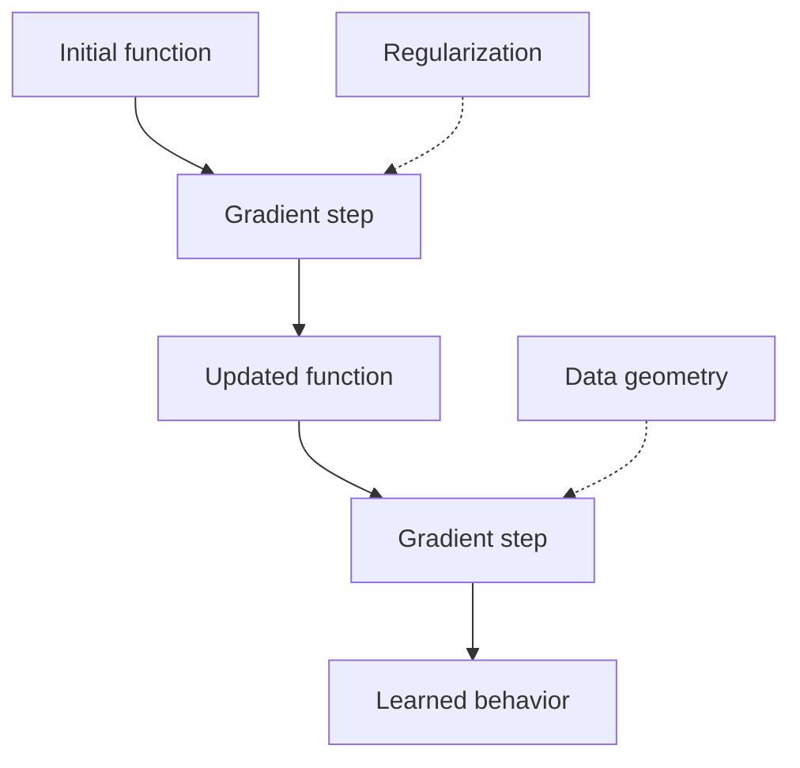

## Premise

Optimization can be read as geometry: an evolving path through function space, constrained by parameterization, data, and loss.

The path often matters as much as the endpoint. Two systems can land at comparable loss values and still carry very different internal structure.

## Minimal Step

```python
def step(params, grad, lr):
    return {
        name: value - lr * grad[name]
        for name, value in params.items()
    }
```

This is the familiar local move. The interesting part is what the move means after being projected through the model's parameterization.

## Reading the Trajectory



## Open Thread

The full version should include diagrams, references, and a compact derivation that keeps the mechanics legible.
