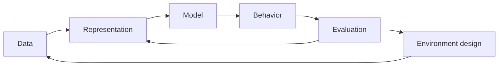

## Premise

Intelligence is not only a matter of scale. It is also a question of what a system is encouraged to notice, preserve, and ignore.

An inductive bias can be read as a wager: this structure will make some realities easier to learn than others. The wager may be architectural, statistical, procedural, or social.

The working object here is the `prior`: sometimes explicit, often hidden in defaults.

## A Small Sketch

The simplest useful split is between the **space of possible functions** and the **path the system is likely to take** through that space.

```ts
type Prior<T> = {
  constrain: (space: T[]) => T[];
  prefer: (candidate: T) => number;
};

function choose<T>(space: T[], prior: Prior<T>) {
  return prior
    .constrain(space)
    .toSorted((a, b) => prior.prefer(b) - prior.prefer(a))[0];
}
```

That code is deliberately too small. It still captures the pressure: bias is not always a hard rule. Sometimes it is only a gradient.

## System View



## Open Thread

The next version should connect this to evaluation, environment design, and where architectural bias still matters when data is abundant.
