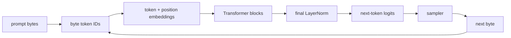
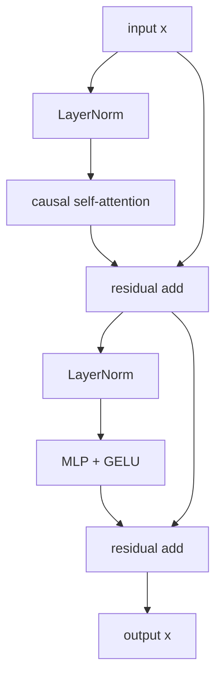

I started TinyLLM-DS because I wanted to know whether a local Transformer
language model could run on original Nintendo DS hardware at all. Not in an
emulator with desktop resources. Not by using the DS as a thin client for a
server. A real `.nds` homebrew ROM, a model file on a flashcart, and a small C
runtime doing inference locally.

The Nintendo DS is a useful constraint machine. It has 4 MiB of main RAM, a
small ARM9 CPU, no hardware floating-point unit, awkward storage, and two tiny
screens for debugging. On hardware like this, vague ML abstractions become very
literal: tensors need an exact layout, every allocation competes with the rest
of the program, FP32 math runs through software routines, and repeated work shows
up immediately.

This article is not a survey of every LLM architecture. It follows the model I
actually built: a tiny byte-level GPT-style Transformer, trained on a MacBook,
exported to `.model` (this project's small custom model file), validated against
a C runner, and run on the DS. The point is to make the model legible all the
way down to the code.

## What the model is

The precise technical description of TinyLLM-DS is:

```text
byte-level autoregressive decoder-only causal Transformer language model
```

Each word matters:

| term           | meaning in TinyLLM-DS                                                    |
| -------------- | ------------------------------------------------------------------------ |
| byte-level     | token IDs mostly represent raw byte values                               |
| autoregressive | generation happens one token at a time, conditioned on previous tokens   |
| decoder-only   | the model keeps the generation side of the original Transformer          |
| causal         | attention is masked so positions cannot look into the future             |
| Transformer    | the network is built from self-attention, MLPs, residuals, and LayerNorm |
| language model | the model assigns probabilities to token sequences                       |

More casually, TinyLLM-DS is a tiny byte-level GPT-style Transformer.

It is not an [RNN](https://en.wikipedia.org/wiki/Recurrent_neural_network)
language model. An RNN carries one recurrent hidden state forward:

```text
token 0 + hidden 0 -> hidden 1
token 1 + hidden 1 -> hidden 2
token 2 + hidden 2 -> hidden 3
```

TinyLLM-DS uses Transformer self-attention over a visible context window instead.

In the baseline runtime, that visible context is recomputed for each generated
token. In the later KV-cache experiment (coming with a second article soon),
previous attention keys and values are stored to avoid recomputing old tokens,
but that cache is still Transformer attention state, not an RNN hidden state.

## Generation as repeated next-token prediction

At runtime, the interface is simple:

```text
recent tokens -> logits for the next token
```

The model returns one score, or logit, for every possible token. A sampler turns
those scores into one concrete next token. Then the runtime appends that token
and asks again.



For example:

```text
input:  Once upon a time,
next:   " "

input:  Once upon a time, <space>
next:   "t"

input:  Once upon a time, t
next:   "h"

input:  Once upon a time, th
next:   "e"
```

The model is obviously not storing stories. It has learned parameters that turn a context
into a probability distribution over possible next bytes. Syntax, local meaning,
style, and TinyStories-like regularities are not hand-coded; they emerge because
training repeatedly asks the model to predict the next byte in real text.

More formally, an autoregressive language model factorizes a sequence
probability into one next-token decision after another:

```text
P(x0, x1, x2, ..., xN)
  = P(x0) * P(x1 | x0) * P(x2 | x0, x1) * ... * P(xN | x0, ..., xN-1)
```

That formula is the reason the runtime can expose only one step. Repeating that
one-step interface is enough to generate a sequence.

The word `decoder` comes from the original encoder-decoder Transformer used for
sequence-to-sequence tasks such as translation:

```text
source sentence -> encoder -> decoder -> target sentence
```

The encoder turns the whole source sequence into contextual source vectors. The
decoder writes the target sequence one token at a time, using masked
self-attention over earlier target tokens and cross-attention over the encoder's
source vectors.

TinyLLM-DS removes the encoder and cross-attention. What remains is the
generation side:

```text
previous bytes -> masked self-attention -> next-byte logits
```

Do not confuse this with tokenizer decoding. Here, `decoder` means "the
Transformer stack that produces next-token logits." Tokenizer decoding is the
separate step that turns token IDs back into bytes or text.

## Why byte tokens

Most production LLMs use subword tokenizers. A word like `unbelievable` might be
split into pieces such as `un`, `believ`, and `able`.

TinyLLM-DS is byte-level. Every byte is a token:

|   token ID | meaning                    |
| ---------: | -------------------------- |
|   `0..255` | literal byte values        |
|      `256` | EOS, end of sequence       |
|      `257` | BOS, beginning of sequence |
|      `258` | PAD                        |
|      `259` | UNK                        |
| `260..263` | reserved                   |

Total vocabulary size:

```text
264 tokens
```

Conceptually, prompt encoding is almost trivial:

```c
int encode_bytes(const char *text, int *tokens, int max_tokens) {
    int n = 0;
    while (text[n] != '\0' && n < max_tokens) {
        tokens[n] = (unsigned char)text[n];
        n++;
    }
    return n;
}
```

That is a good tradeoff for our limited hardware:

- no tokenizer library on the handheld
- no Unicode segmentation logic
- no BPE merge table
- no large vocabulary file
- only 264 logits per generation step

The cost is sequence efficiency. `Once` is four byte tokens, not one word token,
so the fixed context window fills faster.

Could the DS run a BPE or SentencePiece tokenizer? Yes. It is not impossible.

But it is not the right tradeoff for our baseline version of the language model
we are creating. A subword tokenizer needs extra model metadata, a vocabulary
table, merge rules or a tokenizer model, UTF-8/string handling, and more loader
validation. More importantly, it usually makes the vocabulary much larger.

Current byte-level shape:

```text
vocab = 264
embedding = 96
token embedding table = 264 x 96 = 25,344 weights
logits per step = 264 scores
```

Even a small subword vocabulary changes that quickly:

```text
vocab = 8,000
embedding = 96
token embedding table = 8,000 x 96 = 768,000 weights
logits per step = 8,000 scores
```

That embedding/logits table alone would be larger than the current whole DS
model. The upside is real: subword tokens would make the context window more
efficient. `Once upon a time` might take a few tokens instead of sixteen byte
tokens. But the DS bottlenecks are RAM, CPU time, and runtime simplicity. Byte
tokens keep the loader small, the logits cheap, and the model file easy to
validate. A tiny BPE vocabulary could be a useful later experiment, but it is
not the baseline ABI.

## Context window

The current DS model has a context window of:

```text
T = 96 tokens
```

Because TinyLLM-DS uses byte tokens, this is closer to 96 bytes or characters
than 96 English words. The model can attend only to tokens inside that visible
window.

During generation, the context contains the prompt plus bytes generated so far:

```text
prompt bytes + generated bytes -> current 96-token window
```

If the prompt plus generated text grows past 96 tokens, the runtime slides the
window forward and drops the oldest bytes:

```text
[oldest ... current token] + next token
          becomes
[... current token, next token]
```

This is not long-term memory. It is just the token span the Transformer receives.

Why 96? It is a DS hardware tradeoff:

- the learned position table has `96 x 96` values
- runtime scratch buffers scale with `T x D`
- attention work grows with context length, and full-context attention grows
  roughly with `T^2`
- the baseline runtime recomputes the full visible prefix for each generated byte

A larger context would give the model more recent text to use, but it would cost
more RAM and CPU time on a 4 MiB, no-FPU handheld. `ctx96` is the current
compromise that still fits the DS target while producing more recognizable
TinyStories-style fragments.

## Model shape and parameter count

The current TinyLLM-DS shape is:

| target | layers | embedding dim | heads | context | vocab |
| ------ | -----: | ------------: | ----: | ------: | ----: |
| DS     |      4 |            96 |     4 |      96 |   264 |

In this article:

```text
V = vocabulary size
T = maximum context length
L = number of Transformer blocks
D = embedding dimension
```

The DS model has about `478k` parameters. That is not a benchmark result and it
is not the size of the `.nds` ROM. It is the number of learned scalar values in
the model.

We count:

- token embedding table
- learned position embedding table
- LayerNorm scale vectors
- attention projection matrices
- MLP matrices
- final LayerNorm scale

We do not count temporary activations, logits buffers, sampler state, optimizer
state, the KV cache, or Q8 row scales. Those matter for memory and runtime, but
they are not learned model parameters. The output embedding is tied to the token
embedding table, so there is no separate `D x V` output matrix. The linear
layers also omit biases.

In TinyLLM-DS, each Transformer block has two LayerNorm scale vectors, attention
weights, and MLP weights. The `qkv` weight is one packed matrix for query, key,
and value projections, so it has the same parameter count as three separate
`D x D` matrices.

| component            |    shape |  count | why                                     |
| -------------------- | -------: | -----: | --------------------------------------- |
| `ln1` scale          |      `D` |    `D` | LayerNorm scale only, no bias           |
| `qkv` weight         | `3D x D` | `3D^2` | query, key, and value projections       |
| attention projection |  `D x D` |  `D^2` | maps attention output back to width `D` |
| `ln2` scale          |      `D` |    `D` | LayerNorm scale only, no bias           |
| MLP up weight        | `4D x D` | `4D^2` | expands hidden width to `4D`            |
| MLP down weight      | `D x 4D` | `4D^2` | projects MLP output back to `D`         |

So one block has:

```text
D + 3D^2 + D^2 + D + 4D^2 + 4D^2
  = 12D^2 + 2D parameters
```

The full model adds token embeddings, position embeddings, `L` blocks, and one
final LayerNorm scale vector:

```text
token embeddings     V x D
position embeddings  T x D
L blocks             L x (12D^2 + 2D)
final norm           D
```

For the DS model:

```text
V = 264
T = 96
L = 4
D = 96

token embeddings     264 x 96              =  25,344
position embeddings   96 x 96              =   9,216
one block             12 x 96^2 + 2 x 96   = 110,784
four blocks           4 x 110,784          = 443,136
final norm            96                   =      96

total                                      = 477,792
```

That is where the `~478k params` number comes from.

The position table has 96 rows. A forward pass can use any sequence length from
1 to 96, but it cannot use positions beyond that because no learned position
vector exists there.

## Forward pass

The model structure is small, but it is still recognizably GPT-style:

```text
tokens -> embeddings -> repeated Transformer blocks -> final norm -> logits
```

### Token and position embeddings

Token IDs are integers, but neural networks operate on vectors. The first
learned table is the token embedding table. Here, `V` is vocabulary size and `D`
is embedding dimension:

```text
token_embedding_table[V][D]
```

For TinyLLM-DS:

```text
264 x 96
```

Looking up one token is just a row lookup:

```c
for (int d = 0; d < n_embd; ++d) {
    x[d] = token_embedding_table[token_id * n_embd + d];
}
```

The model learns the values in this table during training. The byte `'t'` does
not start with a hand-written meaning. Its vector becomes useful because
gradient descent shapes it to help predict real training sequences.

Self-attention also needs order information. The bytes in these two prompts are
similar, but the meaning differs:

```text
dog bites man
man bites dog
```

TinyLLM-DS uses learned position embeddings. Here, `T` is maximum context length
and `D` is embedding dimension:

```text
pos_embedding[T][D]
```

The initial hidden vector at position `i` is:

```text
x[i] = token_embedding[token[i]] + pos_embedding[i]
```

Learned position embeddings are simple table lookups. That is good for the DS,
but it also means the runtime cannot use positions beyond the exported table.

### One Transformer block

TinyLLM-DS uses a pre-norm decoder block:

```text
x = x + attention(layernorm(x))
x = x + mlp(layernorm(x))
```



The residual paths let each block add a correction instead of rebuilding the
whole representation from scratch. That makes training easier and keeps
information flowing through multiple layers.

LayerNorm normalizes one hidden vector at a time. In this model, it looks across
the `D` channels of one token position. It does not average across the batch and
it does not average across every token in the sequence.

```text
mean = average(x)
var  = average((x - mean)^2)
normalized_x = (x - mean) / sqrt(var + eps)
```

Many LayerNorm implementations then apply two learned vectors:

- a scale vector, often called `gamma`, which multiplies each channel
- a bias vector, which adds a learned offset to each channel

Those vectors let the model recover useful per-channel strength after
normalization. If a channel should matter more, scale can amplify it. If a
channel should usually sit higher or lower, bias can shift it.

TinyLLM-DS keeps only the learned scale:

```text
y = normalized_x * gamma
```

It omits the learned bias. That saves a small amount of model data and removes
one add per channel in the runtime. The baseline C implementation still computes
variance and `sqrtf`; on the DS, that square root is software floating-point
work and becomes relevant in the optimization lesson.

### Causal self-attention

Self-attention lets each position read information from earlier positions.

Each input vector is projected into three vectors:

```text
q = query
k = key
v = value
```

Intuition:

- query: what this position is looking for
- key: what each visible position offers
- value: the information that gets mixed into the output

Attention score:

```text
score(i, j) = dot(q[i], k[j]) / sqrt(head_dim)
```

After softmax, the attention output is a weighted sum of value vectors:

```text
attention(i) = sum_j softmax(score(i, j)) * v[j]
```

Causal means position `i` can only attend to positions `j <= i`.

```text
token 0 can see: 0
token 1 can see: 0, 1
token 2 can see: 0, 1, 2
token 3 can see: 0, 1, 2, 3
```

That rule prevents cheating during training. When the loss asks for the next
token distribution at position `i`, the model cannot peek at the target token
from the future.

TinyLLM-DS uses four attention heads:

```text
D = 96
heads = 4
head_dim = 24
```

Heads give the model several learned ways to look at the same context. One head
might become useful for local spelling patterns, another for simple phrase
structure. We do not assign those roles manually, and a trained model is not
guaranteed to make heads cleanly interpretable.

After attention, the heads are concatenated and projected back to width `D`.

### MLP, GELU, and logits

The attention layer mixes information across positions. The MLP transforms each
position independently:

```text
hidden = linear(D -> 4D)
hidden = GELU(hidden)
out    = linear(4D -> D)
```

For TinyLLM-DS:

```text
96 -> 384 -> 96
```

GELU is the nonlinear activation:

```text
GELU(x) = 0.5 * x * (1 + erf(x / sqrt(2)))
```

Without a nonlinear function, stacking linear layers would collapse into another
linear layer. GELU lets the model represent more complicated patterns.

After all blocks, the runtime normalizes the final hidden state and computes one
logit per token:

```text
logits[token] = dot(final_hidden, token_embedding[token])
```

TinyLLM-DS ties input and output embeddings. The same table used to turn token
IDs into vectors is reused to score possible output tokens.

```text
without tying: input embedding + output embedding
with tying:    one shared embedding table
```

That saves parameters and is common in larger language models too.

## Training, export, and validation

Training uses next-byte prediction. Given a token sequence:

```text
tokens:  [BOS, O, n, c, e, ..., EOS]
input:   [BOS, O, n, c, e, ...]
target:  [O,   n, c, e,  , ..., EOS]
```

The model emits a logit vector at every position. Cross-entropy compares each
predicted distribution to the shifted target token. Gradient descent updates the
weights so that the true next byte gets a higher score in similar contexts.

PyTorch shape:

```python
logits = model.forward_all(x)  # [batch, time, vocab]
loss = F.cross_entropy(
    logits.reshape(-1, logits.size(-1)),
    y.reshape(-1),
)
```

The DS never trains (not a big surprise). Training needs automatic differentiation, optimizer state,
and large tensor kernels. The DS only runs inference from exported weights.

PyTorch checkpoints are also not loaded directly by the DS. The host exporter
writes a narrow `.model` file:

```text
header
tensor directory
tokenizer metadata
aligned tensor data
```

The runtime validates dimensions and tensor names before using the model. That
is safer than a raw binary dump and much smaller than a general framework
runtime.

Export command:

```sh
.venv/bin/python tools/export_t3m.py \
  --preset nds \
  --checkpoint checkpoints/tinystories/nds-best.pt \
  --quant q8 \
  --out build/model-nds-tinystories-q8.model
```

The same exported model can be tested by the native C runner and loaded by the
DS ROM. Parity matters: the native runner is how we check that the C runtime
matches the PyTorch reference before blaming the handheld for bugs.

## Baseline runtime and why it is slow

The baseline runtime is intentionally direct:

```c
for (int step = 0; step < max_steps; ++step) {
    int n = current_context(tokens, context, n_ctx);
    tinyllm_forward(model, runtime, context, n, logits);
    int next = tinyllm_sample(&sampler, logits, vocab);
    append_token(tokens, next);
}
```

Inside `tinyllm_forward`, it recomputes the whole visible context:

```text
embed all visible tokens
for each layer:
    layernorm all visible tokens
    attention over visible previous tokens
    MLP all visible tokens
final layernorm
logits for last token
```

That is excellent for correctness and parity. But it's also really slow on original DS
hardware because every generated byte repeats work for all earlier visible
bytes.

For each layer and each token, the main dense work is:

```text
qkv projection      D -> 3D
attention output    D -> D
MLP up projection   D -> 4D
MLP down projection 4D -> D
```

Very rough dense cost per layer:

```text
3D^2 + D^2 + 4D^2 + 4D^2 = 12D^2
```

For TinyLLM-DS with `D=96`:

```text
12 * 96 * 96 = 110,592 multiply-adds per token per layer
```

With four layers and many context tokens, that becomes expensive quickly. On the
DS, Q8 weights reduce model storage, but the baseline still does plenty of FP32
work in software. Full-prefix replay and software floating point are the two big
reasons Part 2 of this series of articles will move into fixed-point linears and KV caching.

## Takeaways

A tiny decoder-only Transformer still uses the core components of larger
GPT-style models:

- tokens become vectors
- positions are added
- attention mixes context
- MLPs transform each position
- residuals preserve information
- LayerNorm stabilizes activations
- logits parameterize the current next-token distribution
- sampling turns scores into generated text

TinyLLM-DS keeps those components small and explicit so they can be trained on a
host machine, exported to `.model`, validated against C, and run on Nintendo DS
hardware.

## References

The attention formula, causal masking rule, multi-head split, feed-forward
sub-layer, residual paths, and use of normalization around sub-layers are the
same family of ideas introduced in the Transformer paper. TinyLLM-DS uses a
decoder-only, pre-norm variant, but the core attention equation is the standard
scaled dot-product form:

```text
Attention(Q, K, V) = softmax(Q K^T / sqrt(d_k)) V
```

LayerNorm is described in the Layer Normalization paper as using statistics from
the summed inputs within a layer for a single training case. In this runtime,
that becomes "mean and variance over the channels of one token vector." GELU is
the Gaussian Error Linear Unit, `x * Phi(x)`, implemented here through the exact
`erf` formula.

- Vaswani et al., [Attention Is All You Need](https://arxiv.org/abs/1706.03762)
- Ba, Kiros, and Hinton, [Layer Normalization](https://arxiv.org/abs/1607.06450)
- Hendrycks and Gimpel, [Gaussian Error Linear Units](https://arxiv.org/abs/1606.08415)
