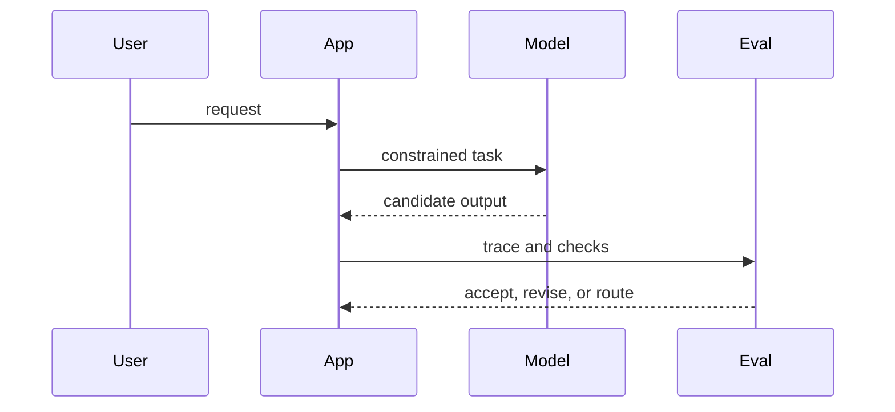

## Premise

Models change quickly. Interfaces, feedback loops, observability, and deployment constraints decide whether a capability becomes useful software.

The model is a component. The system is the thing users actually experience.

## A Practical View

```txt
capability is not product
model output is not state
prompt success is not reliability
```

Durable systems give each model a narrow place to stand. They make traces available, failures explicit, and upgrades boring.

| Layer | Question |
| --- | --- |
| Interface | What is the model allowed to change? |
| Evaluation | How do we know the behavior improved? |
| Runtime | What happens when confidence is low? |

## Upgrade Loop



## Open Thread

I want to add examples from agentic workflows, batch inference, and evaluation pipelines that survived model upgrades cleanly.
